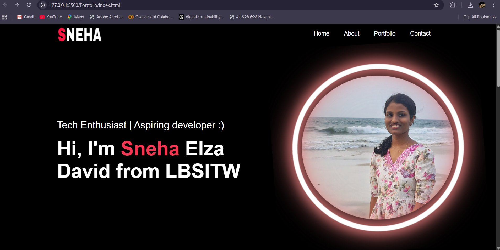
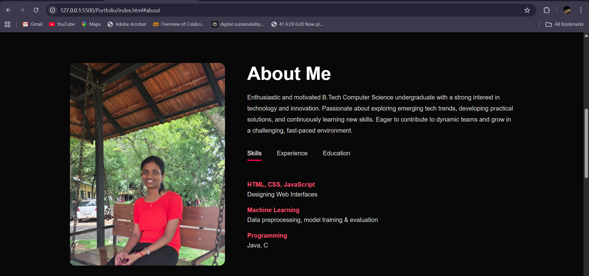
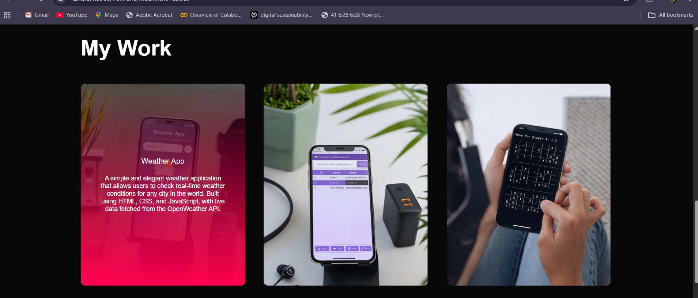
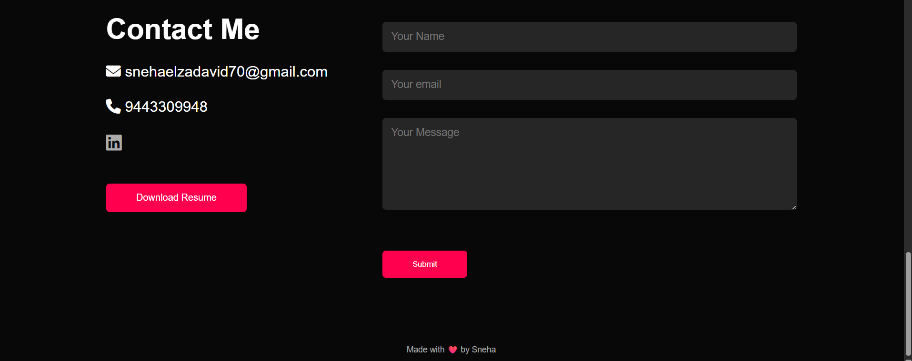

# Personal Portfolio Website 

This is my personal portfolio website built using **HTML**, **CSS**, and **JavaScript**.  
It showcases my skills, projects, and contact information in a clean and responsive layout.


## 🔥 Features

- Responsive design for all screen sizes  
- Clean and modern UI  
- Sections for:
  - Home
  - About Me
  - My Work
  - Portfolio
  - Contact  
- Social media integration (LinkedIn, etc.)


## 🛠️ Technologies Used

- **HTML**
- **CSS**
- **JavaScript**
- **Font Awesome** (for icons)

## 🧩 Sections Included

- **Home** – Introduction and headline  
- **About** – Skills, education, and experience  
- **Portfolio** – Sample work/projects  
- **Contact** – Contact details and social links  

##  How to Run Locally

1. Clone the repository  
   ```bash
   https://github.com/snehaelzadavid06/Personal-Portfolio.git

2. Open the project folder
- cd your-repo-name

3. Open index.html in your browser

## Screenshots





